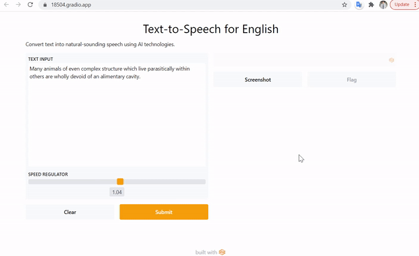

# End-to-End-Text-To-Speech
PyTorch implementation for End-to-End Automatic Text-To-Speech

Reference: 
- [TransformerTTS: FastSpeech](https://github.com/as-ideas/TransformerTTS)
- [MelGAN](https://github.com/seungwonpark/melgan)
- [Support Korean TTS](https://github.com/TensorSpeech/TensorFlowTTS)

<p align="center">
    
    <br>
    <sup>Authors <a Demo</a></sup>
</p>


### Installation
```
apt-get install -y espeak
pip install -r requirements.txt
pip install gradio
```

### Clone the Transformer TTS and MelGAN repos
```
git clone https://github.com/ajaykumar2409/TransformerTTS.git
git clone https://github.com/seungwonpark/melgan.git
```
### Download the pre-trained weights 
```
wget https://public-asai-dl-models.s3.eu-central-1.amazonaws.com/TransformerTTS/ljspeech_melgan_forward_transformer.zip
unzip ljspeech_melgan_forward_transformer.zip
wget https://github.com/seungwonpark/melgan/releases/download/v0.3-alpha/nvidia_tacotron2_LJ11_epoch6400.pt
```

### Try it out on Colab (for English):
[](https://github.com/trandinhson3086/End-to-End-Text-To-Speech/blob/main/synthesize_tts.ipynb)


### For Korean TTS
[

#### Contact

Tran Dinh-Son

Email: trandinhson3086@gmail.com
